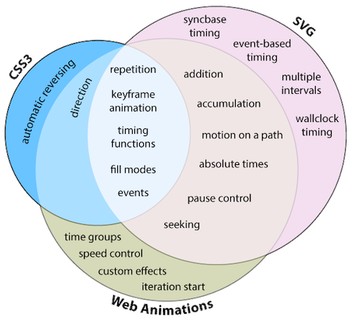

* float을 해제하지 않으면 안되는 이유

* css 애니메이션과 js 애니메이션 차이

  * 프로젝트의 기타 종속성과 원하는 효과의 종류에 따라 어느 애니메이션을 사용할지 결정

  | CSS애니메이션                             | JS애니메이션                                              |
  | ----------------------------------------- | --------------------------------------------------------- |
  | UI 요소 상태 전환과 같은 간단한 원샷 전환 | 바운스, 중지, 일시 중지, 되감기 또는 감속과 같은 고급효과 |

  * HTML5 이전의 애니메이션

    * 느리다: main Thread의 작업에 영향을 받는다.
    * 구현하기 복잡하고 어렵다.

  * HTML5의 애니메이션 기술

    | 구분       | 기술             |
    | ---------- | ---------------- |
    | JavaScript | requestAnimation |
    | CSS        | CSS Transition   |
    | CSS        | CSS Animation    |
    | SVG        | SVG Animation    |

    * 더 빠르다

      requestAnimationFrame은 setTimeout과 사용법은 동일하지만 60fps를 보장한다.

    * 간단하다

      CSS Transition을 이용하면 간단히 구현할 수 있다.

    * 제어할 수 있다.

      애니메이션의 중간 상태를 지정할 수 있다.

  * HTML5의 애니메이션 기술의 문제점

    * 기존의 모델로 좋은 성능이 애니메이션을 만드는 것은 어렵다.
      * CSS style 변경에 따른 구조적 성능 이슈
      * JavaScript 방식은 MainThread를 점유하는 구조적인 문제
    * HTML5 애니메이션 기술들을 효과적으로 쉽게 제어하기 어렵다.

    => Web Animation API의 등장

  * Web Animation API

    통합된 애니메이션 제어 모델을 제공하기 위한 자바스크립트 API

    

    * 기존 애니메이션 모델들에 동기화 된 공용 JavaScript API 제공
    * 기존 애니메이션 규격에서 처리하기 어려운 부분(Dynamic) 보완
    * 구조적 성능 문제 개선

  * Web Animation API 주요 기능

    1. 애니메이션 재생방법의 제어
    2. 애니메이션의 동시적 수행의 조합
    3. 애니메이션 순차적 수행의 조합
    4. SVG 패스를 이용한 애니메이션 구현
