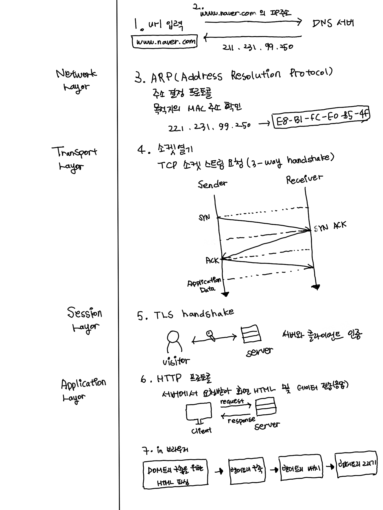

- 웹 브라우저에 URL을 입력하고 화면에 렌더링되기까지의 과정

  ~

- 브라우저의 렌더링 과정에 대해서 상세하게 설명해달라

  * 렌더링 엔진: 요청 받은 내용을 브라우저 화면에 표시.HTML 및 XML문서와 이미지를 표시할 수 있다.

  * 렌더링 엔진의 종류: 게코엔진(파이어폭스), 웹킷엔진(사파리, 크롬)

  * 렌도링 엔진의 기본 동작과정

    1. DOM트리 구축을 위한 HTML 파싱
    2. 렌더 트리 구축
    3. 렌더 트리 배치
    4. 렌더 트리 그리기

  * 웹킷의 동작 과정

    

- OOP

  - OOP에 특징에 대해 설명해달라(상속, 캡슐화 등등...)
  - 현실에 상황을 예로 들어 OOP의 개념으로 설계과정을 설명해달라
    ex) 축구를 게임으로 만든다거나, 기타 어떠한 상황이라도 좋다

- 함수형 프로그래밍(Function Programming)
  - 함수형 프로그래밍에 대해 설명해달라
  - 함수형 프로그래밍에 개념에서 순수함수란 무엇인가
  - OOP와 함수형 프로그래밍의 가장 큰 차이점은 무엇인가

- 비동기 프로그래밍(Asynchronous)
  - AJAX란 무엇인가
  - Promise란 무엇이며 코드가 어떻게 구성되어있는가
  - Promise와 Callback의 차이점은 무엇이며 각각의 장단점에 대해 설명해달라
  - Async, Await가 무엇이며, 사용해본 경험이 있는가
- AMP
  - AMP의 개념은 무엇이고 기존의 것에 비해 장점은 무엇인가
  - 최근의 프레임워크들과의 조합을 고려해 본적이 있는가 ex) vue-amp..
- 타입스크립트를 사용해본 경험이 있는가, 타입스크립트에 대한 본인의 생각과 도입시의 장점을 말해달라
- 자료구조(Data Structure)
  - 자료구조에 대해 공부한 적이 있는가
  - Binary Search Tree 에 대해 알고 있는가, 설명해달라
  - Graph 에서 다른 노드를 참조하는 구조를 코드로 구현 할수 있는가

- RESTful API 가 무엇인가, 아는대로 다 말해달라

- 클라이언트 개발시 보안 관련 이슈
  - 보안은 서버쪽에서 많이 신경쓰고 있지만, 프론트엔드 개발에서 보안관련 이슈는 어떠한 것들이 있는가
  - Wireshark 에 대해 알고 있는가
  - HTTP 통신의 문제점에 대해서 아는대로 말해달라
  - CORS(Cross-Origin Resource Sharing)는 무엇인가 왜 이러한 방법이 정의 되었으며, 본인이 코드를 작성하면서 CORS와 관련하여서 경험하였던 이슈는 무엇인가
  - 간단한 데이터를 클라이언트로만 관리 할수 있는가, 이와 관련해서 브라우저 에서 어떠한 것들을 지원하고 있는가, 예를 들면 소셜 로그인같은 것들에 대한 브라우저 종료시 발생하는 문제에 대응 경험이 있는가

* 프로그래밍 패러다임: 프로그래머에게 프로그래밍의 관점을 갖게하고 결정하는 역할

  * 명령형 프로그래밍: **프로그래밍의 상태**와 **상태를 변경시키는 구문**의 관점에서 연산을 설명하는 방식
    * 절차지향 프로그래밍: 수행되어야 할 연속적인 계산 과정을 포함하는 방식(C, C++)
    * 객체지향 프로그래밍: 객체들의 집합으로 프로그램의 상호작용을 표현(C++, Java, C#)
  * 선언형 프로그래밍: 어떤 방법으로 해야 하는지(How)를 나타내기 보다 무엇(What)과 같은지를 설명하는 방식
    * 함수형 프로그래밍: 순수 함수를 조밯바고 소프트웨어를 만드는 방식(클로저, 하스켈, 리스프)

* 명령형과 선언형 프로그래밍 비교

  * 명령형: **알고리즘을 명시**하고 목표는 명시 안함
  * 선언형: 알고리즘은 명시하지 않고 **목표만 명시**

* 함수형 프로그래밍

  * 계산을 **수학적 함수의 조합**으로 생각하는 방식을 말한다. 이것은 일반적인 프로그래밍 언어에서 함수가 특정 동작을 수행하는 역할을 담당하는 것과 반대되는 개념으로, 함수를 수행해도 외부 값이 변경될 수 있다.

* 함수형 프로그래밍 개념

  * 1급 객체(First Object, 또는 1급 시민): 다음 조건을 만족하는 객체

    ```txt
    자바스크립트에서 함수(Function)는 객체(Object)이므로 1급 함수로 불린다.
    ```

    * 변수나 데이터 구조 안에 담을 수 있다.
    * 파라미터로 전달할 수 있다.
    * 반환값으로 사용할 수 있다.
    * 할당에 사용된 이름과 관계없이 고유한 구별이 가능하다.
    * 동적으로 프로퍼티 할당이 가능하다.

  * 고차 함수(High Order Function): 람다 계산법에서 만들어진 용어로 아래 조건을 만족하는 함수

    ```txt
    고차함수는 1급 함수의 부분 집합이다.
    리액트의 고차 컴포넌트(HOC)는 컴포넌트를 사용하여 위의 조건을 만족하는 컴포넌트를 말한다.
    ```

    * 함수를 파라미터로 전달할 수 있다.
    * 반환값으로 함수를 사용할 수 있다.

  * 불변성(Immutablility)

    * 함수형 프로그래밍에서는 데이터가 변할 수 없는데, 이를 불변성 데이터라고 한다.
    * 데이터가 변경이 필요한 경우, 원본 데이터 구조를 변경하지 않고 그 데이터를 복사본으로 만들어 그 일부를 변경하고 변경한 복사본을 사용해 작업한다.

  * 순수함수: 함수형 프로그래밍에 필요한 개념으로 아래 조건을 만족하는 함수를 뜻한다.

    * 동일한 입력에는 항상 같은 값을 반환해야 한다.
    * 함수의 실행은 프로그램의 실행에 영향을 미치지 않아야 한다.(사이드 이펙트가 없어야 한다.)

  * 데이터 변환 방법

    * 함수형 프로그래밍은 데이터 변경이 불가능하기 때문에 기존 데이터의 복사본을 만들어 주는 도구들이 필요하다.

  * 합성함수

    * 새로운 함수를 만들거나 계산하기 위해 둘 이상의 함수를 조합하는 과정
    * 함수형 프로그램은 작은 순수함수들로 이루어져 있기 때문에 함수들을 연쇄적으로 또는 병렬로 호출해서 더 큰 함수를 만드는 과정으로 전체 프로그램을 구축해야 한다.

  * 함수형 프로그래밍을 구현하는 방법

    * **순수 함수**를 조합하고 공유상태, 변경 가능한 데이터 및 부작용을 피하여 소프트웨어를 만드는 프로세스
    * 함수형 프로그래밍은 명령형이 아닌 **선언형**이며 어플리케이션의 상태는 순수함수를 통해 전달된다.

* 크로스 도메인 이슈(CORS)

  * 동일 출처 정책(same-origin-policy, SOP): 하나의 웹페이지에서 다른 도메인 서버에 요청하는 것을 제한하는 것(보안 상의 이유)

  * 이런한 문제를 해결 하기 위한 방법

    1. 헤더를 이용

       ```js
       // POST, GET, OPTIONS, DELETE, PUT 요청에 대해 허용
       // HTTP Request 요청 전에 Preflight Request 요청 때문에 OPTIONS를 허용 해 줌
       response.setHeader('Access-Control-Allow-Methods', 'POST, GET, OPTIONS, DELETE, PUT')
       
       // Preflight Request를 캐시할 시간, 단위는 초단위
       response.setHeader('Access-Control-Max-Age', 3600)
       
       // 표준화된 규약은 아니지만 보통 AJAX 호출이라는 것을 의미하기 위해 비공식적으로 사용하는 절차
       response.setHeader('Access.Control-Allow-Headers', 'x-requested-with')
       
       // 특정 도메인에 대한 허용
       response.setHeader('Access-Control-Allow-Origin', '*')
       ```

    2. jsonp(JSON with Padding)

       * jsonp의 원리

         * `<script/>`는 SOP 정책에 속하지 않는다는 사실을 근거로 서로 다른 도메인간의 자바스크립트 호출을 위하여 jsonp가 사용되었다. 
         * jsonp를 사용하기 위해서는 필수적으로 서버단에서 jsonp의 포맷을 따라야 한다. 이것은 jsonp를 사용하기 위한 규칙이다.

       * jsonp 구현

         ```html
         <!--자바스크립트를 포함시킨 것이 아니라 실행시킨 것-->
         <script type="text/javascript" src="http://kingbbode.com/result.json?callback=parseResponse"></script>
         ```

         ```js
         var script = document.createElement('script')
         script.src = '//kingbbode.com/jsonp?callback=parseResponse'
         document.getElementsByTagName('head')[0].appendChild(script)
         function parseResponse(data) {
             // callback method
         }
         ```

         ```html
         <!--서버 코드-->
         <script type="text/javascript">
             parseResponse({"Name": "Foo", "Id": 1234, "Rank": 7})
         </script>
         ```
